#  Lab 8 — Audit Défensif de Sécurité Mobile

> Analyse de la posture de sécurité de l'application **InsecureBankv2** à l'aide des outils **BeVigil** et **Yaazhini**
>
> **Analyste** : Amira Ezbiri · **Statut** : Terminé

---

## Sommaire

- [Contexte et cadre légal](#-contexte-et-cadre-légal)
- [Arborescence du projet](#-arborescence-du-projet)
- [Task 0 & 1 — Mise en place du workspace](#-task-0--1--mise-en-place-du-workspace)
- [Task 2 — Préparation de l'artefact](#-task-2--préparation-de-lartefact)
- [Task 3 & 4 — Analyse BeVigil](#-task-3--4--analyse-bevigil)
- [Task 5 & 6 — Analyse Yaazhini](#-task-5--6--analyse-yaazhini)
- [Task 7 — Triage et normalisation](#-task-7--triage-et-normalisation)
- [Task 8 — Corrélation OWASP](#-task-8--corrélation-owasp)
- [Task 9 — Synthèse et constats majeurs](#-task-9--synthèse-et-constats-majeurs)
- [Task 10 — Clôture](#-task-10--clôture)
- [Outils utilisés](#-outils-utilisés)

---

## Contexte et cadre légal

Ce lab s'inscrit dans un **cadre strictement défensif et pédagogique**. Aucune exploitation de vulnérabilité n'a été tentée.

| Champ | Détail |
|---|---|
| **Application** | InsecureBankv2 — `com.android.insecurebankv2` v1.0 |
| **Éditeur** | Security Innovation (application open source pédagogique) |
| **Type** | APK pédagogique fourni par l'enseignant |
| **Hash SHA-256** | `B18AF2A0E44D7634BBCDF93664D9C78A2695E050393FCFBB5E8B91F902D194A4` |
| **Outils** | BeVigil (interface web), Yaazhini v2.0.2 |
| **Environnement** | Windows 11 — PowerShell |

**Limites respectées** :
- Aucune exploitation des vulnérabilités découvertes
- Aucun test intrusif
- Aucun contournement de mécanismes de sécurité
- Aucune cible non autorisée

---

## Arborescence du projet

```
lab8/
├── 00-scope/                  # Périmètre et artefact
│   ├── scope.md
│   └── targets.txt
├── 01-bevigil/                # Résultats BeVigil
│   ├── bevigil_notes.md
│   └── bevigil_export_summary.txt
├── 02-yaazhini/               # Résultats Yaazhini
│   └── yaazhini_notes.md
├── 03-triage/                 # Triage et corrélation
│   ├── triage.csv
│   └── owasp_mapping.md
├── 04-report/                 # Rapport final
│   └── rapport_final.md
├── analyse_info.txt           # Métadonnées de traçabilité
├── commands.log               # Historique des commandes
├── checklist_fin.md           # Clôture signée
└── README.md                  # Ce fichier (compte rendu)
```

---

## Task 0 & 1 — Mise en place du workspace

### Objectif
Créer la structure de dossiers normalisée, initialiser les fichiers de traçabilité (`analyse_info.txt`, `commands.log`) et définir le périmètre d'analyse dans `scope.md`.

### Réalisation

La première étape a consisté à créer les cinq répertoires du lab et à rédiger les fichiers de traçabilité via PowerShell :

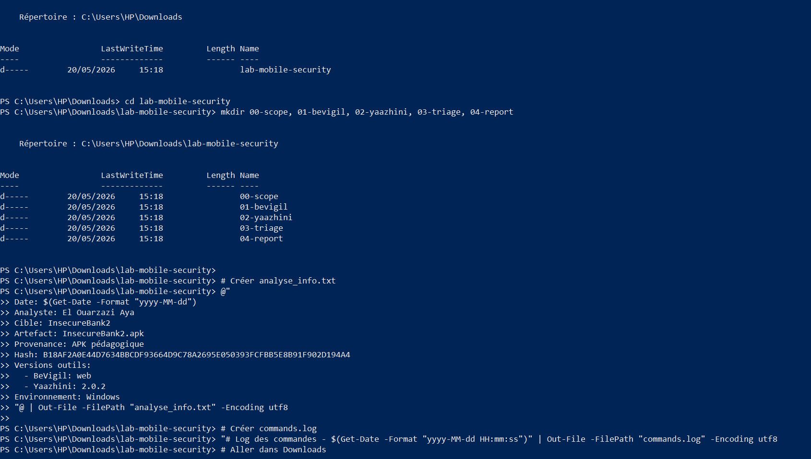

Le fichier `scope.md` a ensuite été rédigé pour formaliser le périmètre autorisé, les limites éthiques et la durée prévue de l'analyse :

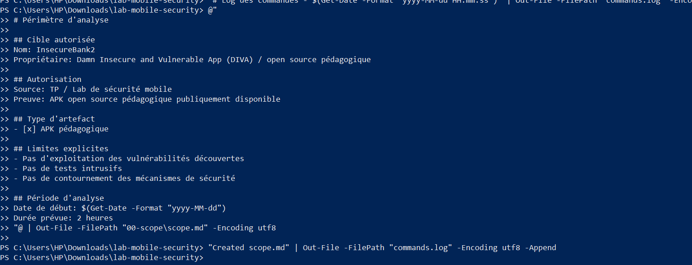

### Ce qu'il faut retenir
- Chaque commande exécutée est consignée dans `commands.log` pour assurer la **reproductibilité**
- Le fichier `analyse_info.txt` centralise les métadonnées : date, analyste, cible, hash, versions outils
- Le `scope.md` fait office de **contrat d'engagement** délimitant strictement l'analyse

---

## Task 2 — Préparation de l'artefact

### Objectif
Copier l'APK dans le répertoire `00-scope/`, calculer son empreinte SHA-256 pour garantir l'intégrité, et mettre à jour les fichiers de traçabilité.

### Réalisation

L'APK `InsecureBankv2.apk` a été copié depuis le dossier de téléchargement vers `00-scope/`. Le hash SHA-256 a ensuite été calculé avec `Get-FileHash` et reporté dans `analyse_info.txt` :

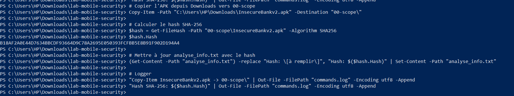

### Résultat
```
Hash SHA-256 : B18AF2A0E44D7634BBCDF93664D9C78A2695E050393FCFBB5E8B91F902D194A4
```

Ce hash constitue l'**empreinte digitale** de l'artefact. Il permet de vérifier que le fichier analysé n'a pas été altéré entre sa réception et la fin de l'analyse.

---

## Task 3 & 4 — Analyse BeVigil

### Objectif
Utiliser la plateforme BeVigil (CloudSEK) pour scanner l'application et collecter les signaux d'exposition externes : assets, endpoints, domaines, technologies, trackers.

### Prise en main de BeVigil

L'application a été recherchée sur [bevigil.com](https://bevigil.com) via son identifiant de package. Le dashboard affiche un **score de sécurité de 7.4/10 (AVERAGE)** avec un total de **5 catégories de problèmes** détectés :

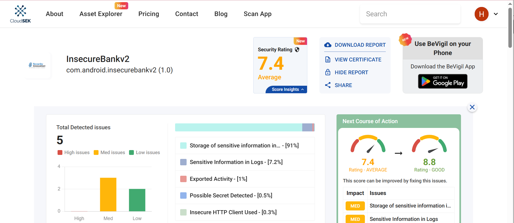

### Détail des issues détectées par BeVigil

La vue détaillée montre la sévérité des problèmes par catégorie (Vulnerabilities, Manifest, Assets, Strings) ainsi que les résumés à droite :

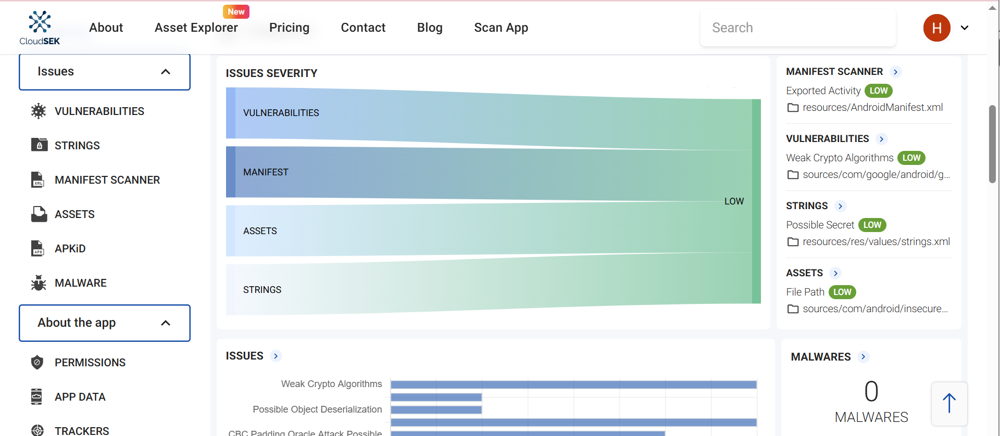

### Collecte des résultats

Les données extraites de BeVigil ont été documentées dans le fichier `bevigil_notes.md` et un résumé structuré dans `bevigil_export_summary.txt` :

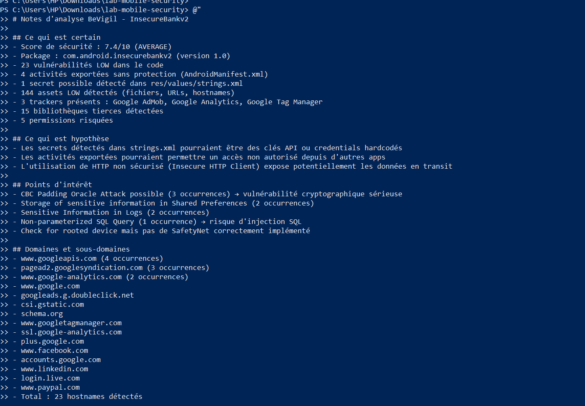

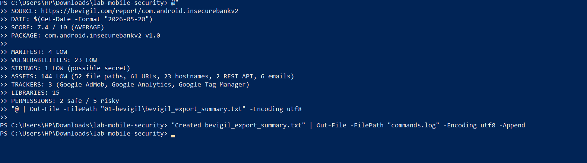

### Synthèse BeVigil

| Catégorie | Résultat |
|---|---|
| **Score** | 7.4/10 (AVERAGE) |
| **Vulnérabilités** | 23 LOW |
| **Manifest** | 4 activités exportées sans protection |
| **Strings** | 1 secret potentiel (strings.xml) |
| **Assets** | 144 LOW (52 fichiers, 61 URLs, 23 hostnames, 2 REST API, 6 emails) |
| **Trackers** | Google AdMob, Google Analytics, Google Tag Manager |
| **Bibliothèques** | 15 détectées |
| **Permissions** | 2 safe / 5 risky |

---

## Task 5 & 6 — Analyse Yaazhini

### Objectif
Effectuer une analyse statique approfondie de l'APK avec Yaazhini pour identifier les vulnérabilités dans le code, le manifest et les configurations internes.

### Lancement de l'analyse

Le projet a été configuré sous le nom **LAB8** dans Yaazhini, avec l'APK `InsecureBankv2.apk` en entrée. La décompilation s'est déroulée sans erreur :

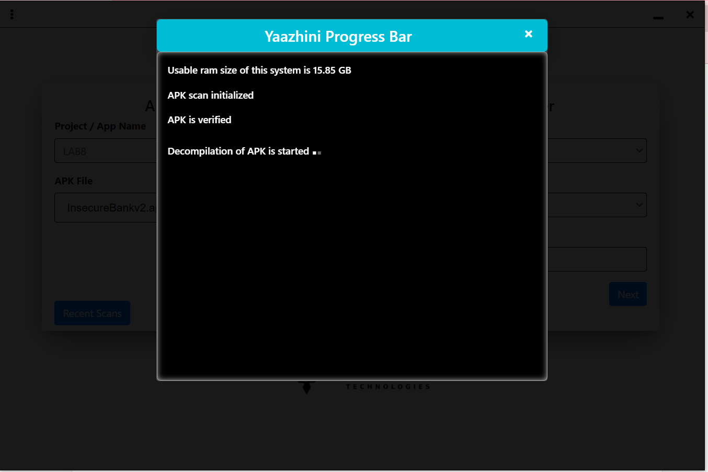

### Rapport Yaazhini

Une fois l'analyse terminée, Yaazhini génère un rapport HTML complet avec un résumé de l'application (App Summary) :

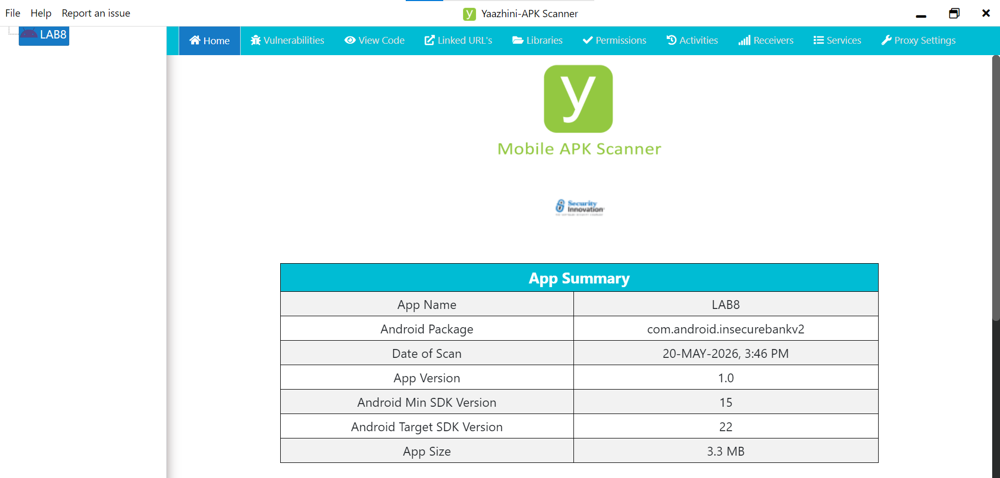

### Constats documentés

L'analyse du rapport a permis d'identifier **7 éléments majeurs** documentés dans `yaazhini_notes.md` :

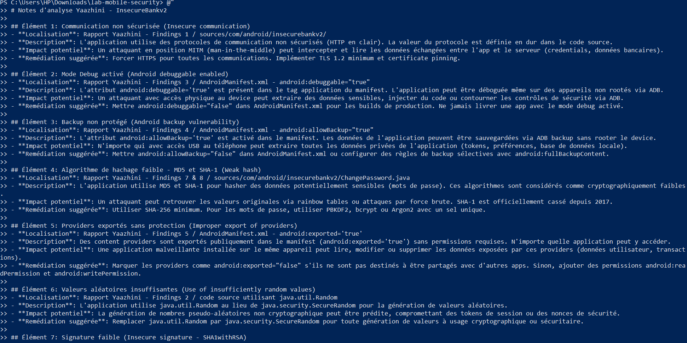

### Éléments identifiés par Yaazhini

| # | Élément | Sévérité | Fichier concerné |
|---|---|---|---|
| 1 | Communication HTTP en clair | High | sources/com/android/insecurebankv2/ |
| 2 | Mode debug activé (`debuggable=true`) | High | AndroidManifest.xml |
| 3 | Backup ADB activé (`allowBackup=true`) | High | AndroidManifest.xml |
| 4 | Hachage MD5/SHA-1 pour les mots de passe | High | ChangePassword.java |
| 5 | Content Providers exportés sans permission | High | AndroidManifest.xml |
| 6 | Générateur aléatoire non cryptographique | Medium | java.util.Random |
| 7 | Signature APK faible (SHA1withRSA) | Medium | Certificat de signature |

---

## Task 7 — Triage et normalisation

### Objectif
Consolider les résultats BeVigil et Yaazhini dans un fichier `triage.csv` unique, éliminer les doublons et attribuer un identifiant, une sévérité et un statut à chaque constat.

### Réalisation

Les résultats des deux outils ont été fusionnés en **12 constats uniques** (FIND-001 à FIND-012). Les doublons entre BeVigil et Yaazhini ont été consolidés (par exemple FIND-001 provient des deux sources) :

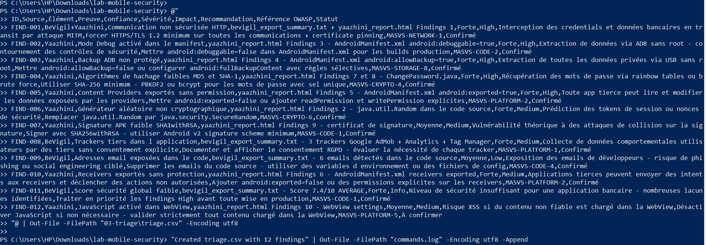

### Répartition par sévérité

| Sévérité | Nombre | Pourcentage |
|---|---|---|
|**High** | 5 | 42% |
|**Medium** | 4 | 33% |
|**Low** | 1 | 8% |
|**Info** | 2 | 17% |

---

## Task 8 — Corrélation OWASP

### Objectif
Relier chaque constat aux standards **OWASP MASVS** (Mobile Application Security Verification Standard) pour contextualiser les findings dans un cadre reconnu par l'industrie.

### Réalisation

Le fichier `owasp_mapping.md` a été créé avec **10 mappings** couvrant les catégories MASVS suivantes :

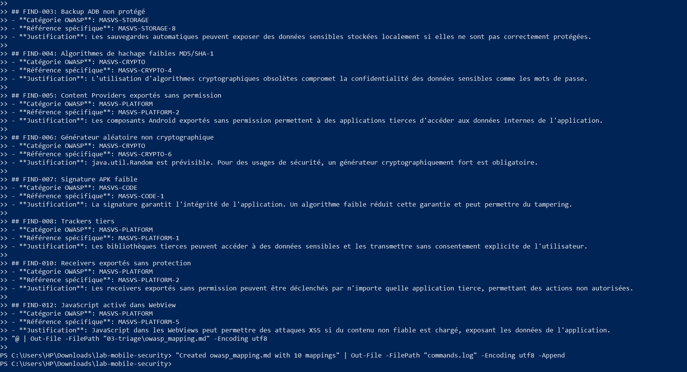

### Catégories OWASP mobilisées

| Catégorie MASVS | Constats associés | Description |
|---|---|---|
| **MASVS-NETWORK** | FIND-001 | Sécurité des communications réseau |
| **MASVS-CODE** | FIND-002, FIND-007 | Qualité du code et configuration |
| **MASVS-STORAGE** | FIND-003 | Protection des données stockées |
| **MASVS-CRYPTO** | FIND-004, FIND-006 | Utilisation correcte de la cryptographie |
| **MASVS-PLATFORM** | FIND-005, FIND-008, FIND-010, FIND-012 | Interaction sécurisée avec la plateforme Android |

---

## Task 9 — Synthèse et constats majeurs

### Top 5 des vulnérabilités identifiées

#### 1. Communication HTTP en clair (FIND-001)
L'application transmet des données sensibles (credentials, informations bancaires) via le protocole HTTP non chiffré. Un attaquant en position man-in-the-middle peut intercepter l'intégralité du trafic réseau.
> **Recommandation** : Forcer HTTPS avec TLS 1.2+ et implémenter le certificate pinning.

#### 2. Mode Debug activé en production (FIND-002)
L'attribut `android:debuggable="true"` dans le manifest permet à quiconque possédant ADB d'attacher un debugger à l'application sur un appareil non rooté, exposant les données internes.
> **Recommandation** : Mettre `android:debuggable="false"` pour les builds de production.

#### 3. Backup ADB non protégé (FIND-003)
Avec `android:allowBackup="true"`, les données privées de l'application (tokens, préférences, base de données) peuvent être extraites via un simple câble USB sans rooter l'appareil.
> **Recommandation** : Désactiver le backup ou configurer des règles sélectives via `fullBackupContent`.

#### 4. Algorithmes cryptographiques obsolètes (FIND-004)
L'application utilise MD5 et SHA-1 pour le hachage des mots de passe. Ces algorithmes sont considérés cassés et permettent la récupération des valeurs originales via rainbow tables.
> **Recommandation** : Migrer vers bcrypt, Argon2 ou PBKDF2 avec un sel unique.

#### 5. Composants Android exportés sans protection (FIND-005)
Des Content Providers sont exposés publiquement sans permissions, permettant à toute application tierce installée de lire ou modifier les données internes.
> **Recommandation** : Ajouter `android:exported="false"` ou des permissions explicites.

### 3 Actions prioritaires

1. **Sécuriser les communications** — Migrer tout le trafic vers HTTPS/TLS 1.2+ avec certificate pinning
2. **Durcir le manifest** — Désactiver debug, backup, et restreindre l'export des composants
3. **Moderniser la cryptographie** — Remplacer MD5/SHA-1 par SHA-256+ et java.util.Random par SecureRandom

---

## Task 10 — Clôture

### Vérifications finales

- [x] Périmètre clairement défini et respecté
- [x] Informations de traçabilité complètes
- [x] Hash de l'APK documenté
- [x] Exports BeVigil sauvegardés
- [x] Rapport Yaazhini sauvegardé
- [x] Notes d'analyse complètes
- [x] Triage.csv rempli avec 12 constats
- [x] Mapping OWASP réalisé pour 10 constats
- [x] Rapport final complet et structuré
- [x] Aucun secret exposé dans les fichiers
- [x] Aucune donnée personnelle exposée
- [x] Aucune technique d'exploitation documentée

> **Signé** : Amira Ezbiri — 28 mai 2026

---

## Outils utilisés

| Outil | Version | Rôle |
|---|---|---|
| **BeVigil** | Web (bevigil.com) | Analyse externe de la posture de sécurité mobile |
| **Yaazhini** | 2.0.2 | Analyse statique approfondie de l'APK |
| **PowerShell** | Windows 11 | Scripting et automatisation des tâches |
| **OWASP MASVS** | v2 | Référentiel de corrélation des constats |

---

<p align="center"><em>Lab réalisé dans le cadre du cours de sécurité mobile — Université</em></p>
